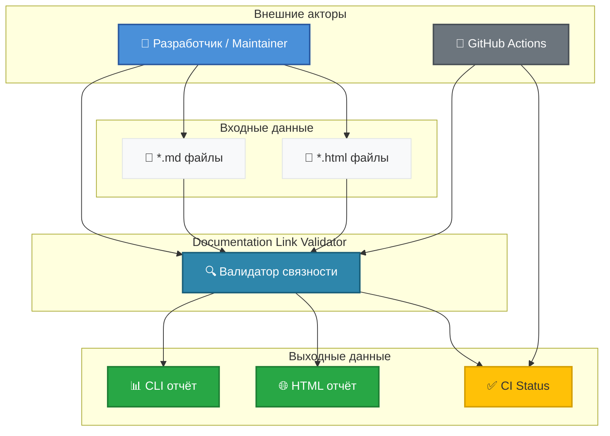
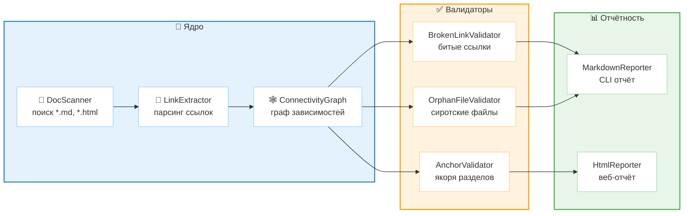

# Архитектура Documentation Link Validator

## Контекст (C4 Level 1)

```mermaid
flowchart TD
    subgraph "Внешние акторы"
        User[👤 Разработчик / Maintainer]
        CI[🔄 GitHub Actions]
    end
    
    subgraph "Documentation Link Validator"
        Validator[🔍 Валидатор связности]
    end
    
    subgraph "Входные данные"
        Markdown[📄 *.md файлы]
        HTML[📄 *.html файлы]
    end
    
    subgraph "Выходные данные"
        CLIReport[📊 CLI отчёт]
        HTMLReport[🌐 HTML отчёт]
        CIStatus[✅ CI Status]
    end
    
    User --> Markdown
    User --> HTML
    User --> Validator
    
    Markdown --> Validator
    HTML --> Validator
    
    Validator --> CLIReport
    Validator --> HTMLReport
    Validator --> CIStatus
    
    CI --> Validator
    CI --> CIStatus
    
    style Validator fill:#2E86AB,color:#fff,stroke:#1a5f7a,stroke-width:2px
    style User fill:#4A90D9,color:#fff,stroke:#2c5aa0,stroke-width:2px
    style CI fill:#6C757D,color:#fff,stroke:#495057,stroke-width:2px
    style Markdown fill:#F8F9FA,color:#333,stroke:#DEE2E6,stroke-width:1px
    style HTML fill:#F8F9FA,color:#333,stroke:#DEE2E6,stroke-width:1px
    style CLIReport fill:#28A745,color:#fff,stroke:#1e7e34,stroke-width:2px
    style HTMLReport fill:#28A745,color:#fff,stroke:#1e7e34,stroke-width:2px
    style CIStatus fill:#FFC107,color:#333,stroke:#D39E00,stroke-width:2px
```

## Компоненты (C4 Level 3)

```mermaid
flowchart LR
    subgraph Core["🔧 Ядро"]
        DocScanner[📁 DocScanner<br/>поиск *.md, *.html]
        LinkExtractor[🔗 LinkExtractor<br/>парсинг ссылок]
        DepGraph[🕸 ConnectivityGraph<br/>граф зависимостей]
    end
    
    subgraph Validators["✅ Валидаторы"]
        FileLinkValidator[BrokenLinkValidator<br/>битые ссылки]
        OrphanValidator[OrphanFileValidator<br/>сиротские файлы]
        AnchorValidator[AnchorValidator<br/>якоря разделов]
    end
    
    subgraph Reporters["📊 Отчётность"]
        MdReport[MarkdownReporter<br/>CLI отчёт]
        HtmlReport[HtmlReporter<br/>веб-отчёт]
    end
    
    DocScanner --> LinkExtractor
    LinkExtractor --> DepGraph
    DepGraph --> FileLinkValidator
    DepGraph --> OrphanValidator
    DepGraph --> AnchorValidator
    
    FileLinkValidator --> MdReport
    OrphanValidator --> MdReport
    AnchorValidator --> HtmlReport
    
    style Core fill:#E3F2FD,color:#333,stroke:#2E86AB,stroke-width:2px
    style Validators fill:#FFF3E0,color:#333,stroke:#FF9800,stroke-width:2px
    style Reporters fill:#E8F5E9,color:#333,stroke:#4CAF50,stroke-width:2px
    style DocScanner fill:#FFFFFF,color:#333,stroke:#90CAF9,stroke-width:1px
    style LinkExtractor fill:#FFFFFF,color:#333,stroke:#90CAF9,stroke-width:1px
    style DepGraph fill:#FFFFFF,color:#333,stroke:#90CAF9,stroke-width:1px
    style FileLinkValidator fill:#FFFFFF,color:#333,stroke:#FFCC80,stroke-width:1px
    style OrphanValidator fill:#FFFFFF,color:#333,stroke:#FFCC80,stroke-width:1px
    style AnchorValidator fill:#FFFFFF,color:#333,stroke:#FFCC80,stroke-width:1px
    style MdReport fill:#FFFFFF,color:#333,stroke:#A5D6A7,stroke-width:1px
    style HtmlReport fill:#FFFFFF,color:#333,stroke:#A5D6A7,stroke-width:1px
```