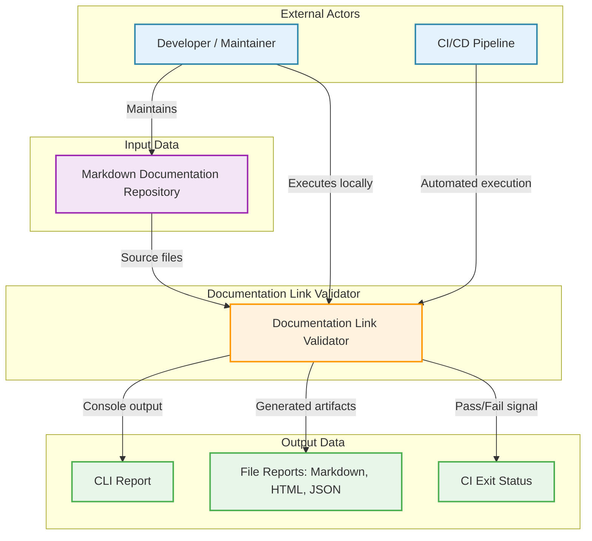
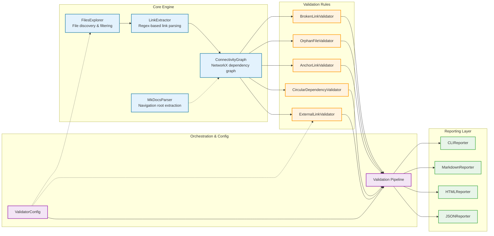

# Documentation Link Validator Architecture

## Context (C4 Level 1)

```mermaid
flowchart TD
    subgraph External Actors
        User[Developer / Maintainer]
        CI[CI/CD Pipeline]
    end

    subgraph Documentation Link Validator
        Validator[Documentation Link Validator]
    end

    subgraph Input Data
        MarkdownRepo[Markdown Documentation Repository]
    end

    subgraph Output Data
        CLIReport[CLI Report]
        FileReports[File Reports: Markdown, HTML, JSON]
        CIStatus[CI Exit Status]
    end

    User -->|Maintains| MarkdownRepo
    User -->|Executes locally| Validator
    CI -->|Automated execution| Validator
    MarkdownRepo -->|Source files| Validator
    Validator -->|Console output| CLIReport
    Validator -->|Generated artifacts| FileReports
    Validator -->|Pass/Fail signal| CIStatus

    classDef actor fill:#E3F2FD,stroke:#2E86AB,stroke-width:2px,color:#333
    classDef system fill:#FFF3E0,stroke:#FF9800,stroke-width:2px,color:#333
    classDef data fill:#F3E5F5,stroke:#9C27B0,stroke-width:2px,color:#333
    classDef output fill:#E8F5E9,stroke:#4CAF50,stroke-width:2px,color:#333

    class User,CI actor
    class Validator system
    class MarkdownRepo data
    class CLIReport,FileReports,CIStatus output
```

## Components (C4 Level 3)

```mermaid
flowchart LR
    subgraph Core ["Core Engine"]
        direction TB
        Explorer[FilesExplorer\nFile discovery & filtering]
        Extractor[LinkExtractor\nRegex-based link parsing]
        Graph[ConnectivityGraph\nNetworkX dependency graph]
        MkDocs[MkDocsParser\nNavigation root extraction]
        
        Explorer --> Extractor --> Graph
        MkDocs -.-> Graph
    end

    subgraph Validators ["Validation Rules"]
        direction LR
        V1[BrokenLinkValidator]
        V2[OrphanFileValidator]
        V3[AnchorLinkValidator]
        V4[CircularDependencyValidator]
        V5[ExternalLinkValidator]
    end

    subgraph Reporters ["Reporting Layer"]
        direction TB
        R1[CLIReporter]
        R2[MarkdownReporter]
        R3[HTMLReporter]
        R4[JSONReporter]
    end

    subgraph Orchestration ["Orchestration & Config"]
        Pipeline[Validation Pipeline]
        Config[ValidatorConfig]
    end

    %% Connections
    Graph --> V1 & V2 & V3 & V4 & V5
    V1 & V2 & V3 & V4 & V5 --> Pipeline
    Pipeline --> R1 & R2 & R3 & R4
    
    Config --> Pipeline
    Config -.-> Explorer
    Config -.-> V5

    %% Styling
    classDef core fill:#E3F2FD,stroke:#2E86AB,stroke-width:2px,color:#333
    classDef validators fill:#FFF3E0,stroke:#FF9800,stroke-width:2px,color:#333
    classDef reporters fill:#E8F5E9,stroke:#4CAF50,stroke-width:2px,color:#333
    classDef orchestration fill:#F3E5F5,stroke:#9C27B0,stroke-width:2px,color:#333

    class Explorer,Extractor,Graph,MkDocs core
    class V1,V2,V3,V4,V5 validators
    class R1,R2,R3,R4 reporters
    class Pipeline,Config orchestration
```
